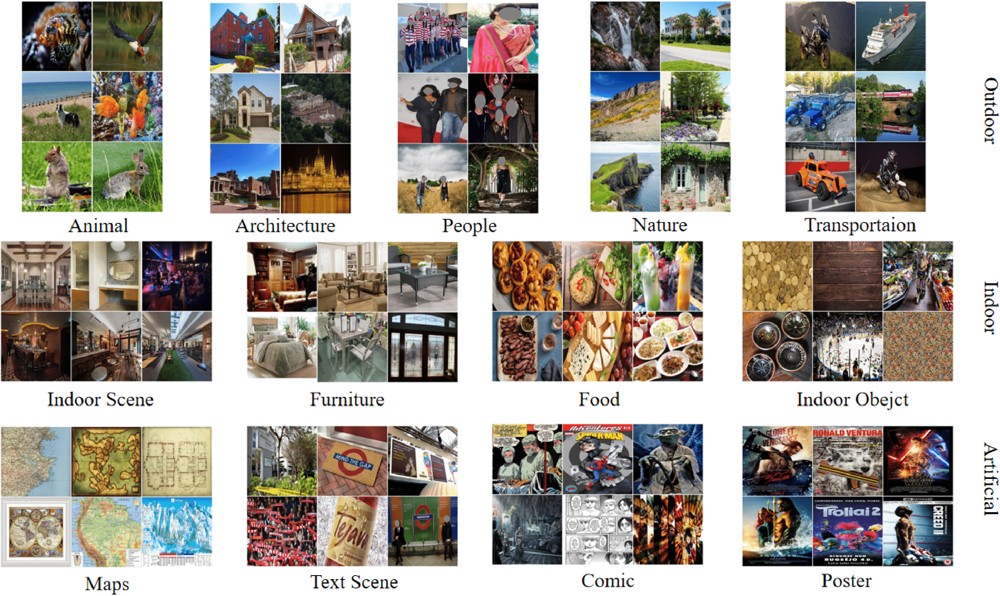
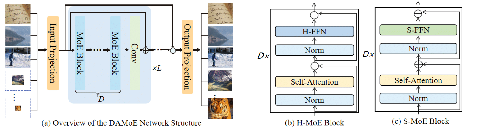

# HQ-50K
HQ-50K: A Large-scale, High-quality Dataset for Image Restoration.
The repository is for our paper [HQ-50K: A Large-scale, High-quality Dataset for Image Restoration](https://arxiv.org/abs/2306.05390).

[Paper](https://arxiv.org/abs/2306.05390) | [Dataset](https://huggingface.co/datasets/YangQiee/HQ-50K) | [Pretrained models]()



### TODO
- [ ] Pretrained models
- [ ] Code release
- [x] ~~Dataset release~~
- [x] ~~Update link to paper and project page~~

50,000 high-quality images with rich texture details and semantic diversity

## Introduction
HQ-50K a large-scale and high-quality image restoration dataset which contains 50,000 high-quality images with rich texture details and semantic diversity, considering the five aspects simultaneously : *Large-Scale*, *High-Resolution*, *Compression Rates*, *Rich texture details* and *Semantic Coverage*. We also present a new Degradation-Aware Mixture of Expert (**DAMoE**) model, which enables a single model to handle multiple corruption types and unknown levels.
## HQ-50K Dataset
In addition to the 50,000 images for training, we also offer 1250 test images that span across various semantic categories and frequency ranges. This new benchmark can facilitate detailed and fine-grained performance comparison and analysis.

### Get the Dataset
1. Download the dataset from [HQ-50K](https://huggingface.co/datasets/YangQiee/HQ-50K) by [img2dataset](https://github.com/rom1504/img2dataset).
The HQ-50K is built as the following folder structure, you can extract it by [scripts](https://github.com/littleYaang/HQ-50K/blob/main/data_preprocess/README.md).
```
│HQ-50K/
├──train/
│  ├── the first  image url
│  ├── the second image url 
│  ├── ......  
│  ├── ......  
│  ├── 50000th    image url
├──val/
│  ├── animal
│  │   ├── ......
│  ├── architcture
│  │   ├── ......

│  ├── ......
```

If the full dataset is not available due to packet loss, we provide [alternative ways](https://github.com/littleYaang/HQ-50K/blob/main/data_preprocess/README.md) for dataset download.

2. Generate paired data corresponding to each task [DataPrepare]().


## DAMoE Model

Coming Soon


## Cite HQ-50K
```
@misc{yang2023hq50k,
      title={HQ-50K: A Large-scale, High-quality Dataset for Image Restoration}, 
      author={Qinhong Yang and Dongdong Chen and Zhentao Tan and Qiankun Liu and Qi Chu and Jianmin Bao and Lu Yuan and Gang Hua and Nenghai Yu},
      year={2023},
      eprint={2306.05390},
      archivePrefix={arXiv},
      primaryClass={cs.CV}
}
```

## License and Acknowledgement
The dataset is released under the CC-BY-4.0 license. And the codes are based on KAIR and Fastmoe. Please also follow their licenses. Thanks for their awesome works.


